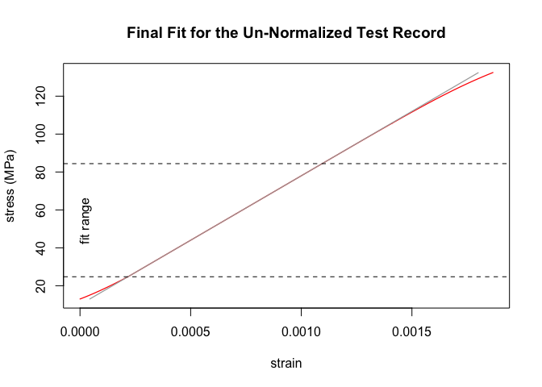

<!-- badges: start -->

[](https://github.com/soylentOrange/sdarr/actions/workflows/R-CMD-check.yaml)
<!-- badges: end -->

<!-- README.md is generated from README.Rmd. Please edit that file -->

# sdarr

The sdarr-package provides a R implementation of the SDAR algorithm for
Slope Determination by Analysis of Residuals as standardized in [ASTM
E3076-18](https://doi.org/10.1520/E3076-18).  
It allows for automated and objective linear-fitting of mechanical
test-data. See a detailed description of the original algorithm in the
[NIST Technical Note 2050 by E.
Lucon](https://doi.org/10.6028/NIST.TN.2050).

As the original algorithm heavily uses linear regressions, a faster
version was implemented here, which finds the optimum region for linear
fitting by random sub-sampling.

## Installation

You can install the development version of sdarr from
[GitHub](https://github.com/) with:

``` r
# install.packages("devtools")
devtools::install_github("soylentOrange/sdarr")
```

## Example

Basic example of the sdarr-function on a synthetic data set. The
synthetic data set is based on the properties of aluminium (Al 6060 T66)
as given in the [Metallic Material Properties Development and
Standardization (MMPDS)
Handbook](https://ntrl.ntis.gov/NTRL/dashboard/searchResults/titleDetail/PB2003106632.xhtml).
A toe-region and a non-zero intercept are added to make the test data
less boring.

The sdarr-function analyzes the data and wil give a small report as a
message. It should confirm the Young’s-modulus of 68 GPa and an
intercept of 10 MPa.

``` r
library(sdarr)
# Synthesize a test record resembling Al 6060 T66
# (Values from MMPDS Handbook, with a toe region added)
Al_6060_T66 <- synthesize_test_data(slope = 68000, yield.y = 160, 
                                    ultimate.y = 215, ultimate.x = 0.091,
                                    offset = 10,
                                    toe.initial.y = 3, toe.max.y = 15,
                                    toe.initial.slope = 34000)

# Analyze the test record
Al_6060_T66.result <- sdarr(Al_6060_T66, x = strain, y = stress, 
                            verbose = "r", showPlots = "r")
#> Determination of Slope in the Linear Region of a Test Record:
#> Standard Practice for Determination of Slope in the Linear Region of a Test Record, ASTM E3076
#>   Data Quality Metric: Digital Resolution
#>     x
#>       Relative x-Resolution:   0.333333333333333
#>       % at this resolution:    0
#>       % in zeroth bin:         100
#>       --> pass
#>     y
#>       Relative y-Resolution:   0.333333333333333
#>       % at this resolution:    1.19402985074627
#>       % in zeroth bin:         98.8059701492537
#>       --> pass
#>   Data Quality Metric: Noise
#>     x
#>       Relative x-Noise:        1.12835262887974e-14
#>       --> pass
#>     y
#>       Relative y-Noise:        0.0590566035999252
#>       --> pass
#>   Fit Quality Metric: Curvature
#>     1st Quartile
#>       Relative Residual Slope: 0.00112596960003188
#>       Number of Points:        40
#>       --> pass
#>     4th Quartile
#>       Relative Residual Slope: -0.00682689398113825
#>       Number of Points:        40
#>       --> pass
#>   Fit Quality Metric: Fit Range
#>       relative fit range:      0.800879700901693
#>       --> pass
#>   Un-normalized fit
#>       Final Slope:             67999.5684247684 MPa
#>       True Intercept:          10.0022190872361 MPa
#>       y-Range:                 24.7366333007812 MPa - 84.4049072265625 MPa
```



## Acknowledgements

The sdarr-package was created for the analysis of mechanical test data
for the project LOBio, which is funded by the German ministry of
education and research (BMBF) under grant number 13XP5174C.
