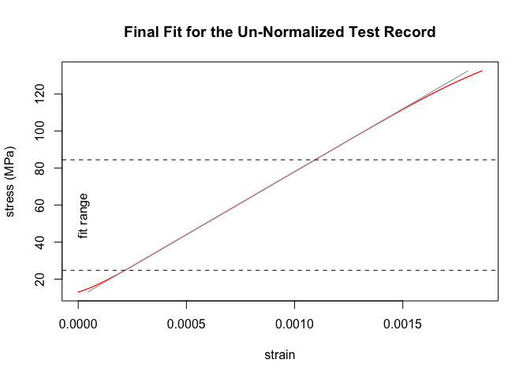
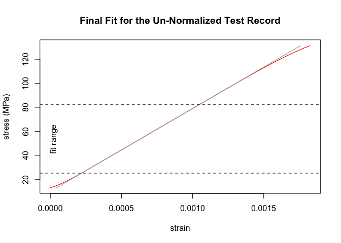
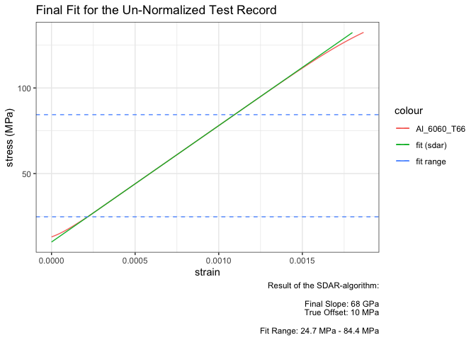

<!-- badges: start -->

[](https://github.com/soylentOrange/sdarr/actions/workflows/R-CMD-check.yaml)
<!-- badges: end -->

<!-- README.md is generated from README.Rmd. Please edit that file -->

# sdarr

The sdarr-package provides a R implementation of the algorithm for Slope
Determination by Analysis of Residuals (SDAR) as standardized in [ASTM
E3076-18](https://doi.org/10.1520/E3076-18).  
It allows for automated and objective linear-fitting of mechanical
test-data. See a detailed description of the algorithm in the [NIST
Technical Note 2050 by E. Lucon](https://doi.org/10.6028/NIST.TN.2050)
or in [Graham & Adler (2011)](https://doi.org/10.1520/JTE103038).

As the SDAR-algorithm, implemented in `sdarr()`, heavily uses linear
regressions, a faster version `sdarr.lazy()` was implemented, which
finds the optimum region for the (one) final linear regression by random
sub-sampling within the normalized range of the test-data.

## Installation

You can install the development version of sdarr from
[GitHub](https://github.com/) with:

``` r
# install.packages("devtools")
devtools::install_github("soylentOrange/sdarr")
```

## Examples

### Standard SDAR-algorithm

A basic example of using `sdarr()` on a synthetic data set, which is
based on the properties of aluminium (Al 6060 T66) as given in the
[Metallic Material Properties Development and Standardization (MMPDS)
Handbook](https://ntrl.ntis.gov/NTRL/dashboard/searchResults/titleDetail/PB2003106632.xhtml).
A toe-region and a non-zero intercept are added to make the test data
less boring.

`sdarr()` analyzes the data and will give a small report as a message.
It should confirm the Young’s-modulus of 68 GPa and an intercept of 10
MPa. To make use of multi-core processing, configure
[furrr](https://furrr.futureverse.org/) to use a multisession strategy.

``` r
library(sdarr)

# setup multisession calculations with a maximum of 8 cores
# (or however many cores are available...)
future::plan(future::multisession,
  workers = min(c(parallelly::availableCores(), 8))
)

# Synthesize a test record resembling Al 6060 T66
# (Values from MMPDS Handbook, with a toe region added)
Al_6060_T66 <- synthesize_test_data(
  slope = 68000, yield.y = 160,
  ultimate.y = 215, ultimate.x = 0.091,
  offset = 10,
  toe.initial.y = 3, toe.max.y = 15,
  toe.initial.slope = 13600
)

# Analyze the test record
Al_6060_T66.result <- sdarr(Al_6060_T66,
  x = strain, y = stress,
  verbose = "r", showPlots = "r", savePlots = TRUE
)
#> Determination of Slope in the Linear Region of a Test Record:
#> SDAR-algorithm
#>   Data Quality Metric: Digital Resolution
#>     x
#>       Relative x-Resolution:   0.333333333333333
#>       % at this resolution:    0
#>       % in zeroth bin:         100
#>       --> pass
#>     y
#>       Relative y-Resolution:   0.333333333333333
#>       % at this resolution:    1.19402985074627
#>       % in zeroth bin:         98.8059701492537
#>       --> pass
#>   Data Quality Metric: Noise
#>     x
#>       Relative x-Noise:        1.12835262887974e-14
#>       --> pass
#>     y
#>       Relative y-Noise:        0.0628385403382046
#>       --> pass
#>   Fit Quality Metric: Curvature
#>     1st Quartile
#>       Relative Residual Slope: 0.00112596960003188
#>       Number of Points:        40
#>       --> pass
#>     4th Quartile
#>       Relative Residual Slope: -0.00682689398113825
#>       Number of Points:        40
#>       --> pass
#>   Fit Quality Metric: Fit Range
#>       relative fit range:      0.800879700901693
#>       --> pass
#>   Un-normalized fit
#>       Final Slope:             67999.5684247684 MPa
#>       True Intercept:          10.0022190872361 MPa
#>       y-Range:                 24.7366333007812 MPa - 84.4049072265625 MPa
```



### Random sub-sampling modification of the SDAR-algorithm

A basic example of `sdarr.lazy()`, a lazy variant of the sdarr-function
on a synthetic data set, which is based on the properties of aluminium
(Al 6060 T66) as given in the [Metallic Material Properties Development
and Standardization (MMPDS)
Handbook](https://ntrl.ntis.gov/NTRL/dashboard/searchResults/titleDetail/PB2003106632.xhtml).
A toe-region and a non-zero intercept are added to make the test data
less boring (see above).

`sdarr.lazy()` analyzes the data for the optimum size of the fitting
region via random sub-sampling. It will give a small report as a message
after finding the optimum fit. It should confirm the Young’s-modulus of
68 GPa and an intercept of 10 MPa. As the data set is rather short,
enforce random sub-sampling by setting `enforce_subsampling = TRUE`.

To make use of multi-core processing, configure
[furrr](https://furrr.futureverse.org/) to use a multisession strategy
(see above).

``` r
# set a random seed
set.seed(50041180)

# Analyze the test record
# (using a relaxed cutoff_probability for the noise-free synthetic data)
Al_6060_T66.result.lazy <- sdarr.lazy(Al_6060_T66,
  x = strain, y = stress,
  cutoff_probability = 0.8,
  enforce_subsampling = TRUE,
  verbose = "r", showPlots = "n"
)
#> Determination of Slope in the Linear Region of a Test Record:
#>   lazy algorithm requires more fits than standard SDAR-algorithm:  
#>     99500 vs. 36856 fits.
#>   Anyways, random sub-sampling will be used...
#> Random sub-sampling modification of the SDAR-algorithm
#>   Random sub-sampling information:
#>       247 points of 337 points in the normalized range were used.
#>       20 % of sub-sampled normalized ranges passed the data quality checks.
#>       100 % of linear regressions passed the fit quality checks.
#>       20 % of linear regressions passed all quality checks.
#> 
#>   Data Quality Metric: Digital Resolution
#>     x
#>       Relative x-Resolution:   0.333333333333333
#>       % at this resolution:    0
#>       % in zeroth bin:         100
#>       --> pass
#>     y
#>       Relative y-Resolution:   0.333333333333333
#>       % at this resolution:    1.19402985074627
#>       % in zeroth bin:         98.8059701492537
#>       --> pass
#>   Data Quality Metric: Noise
#>     x
#>       Relative x-Noise:        1.12835262887974e-14
#>       --> pass
#>     y
#>       Relative y-Noise:        0.0628385403382046
#>       --> pass
#>   Fit Quality Metric: Curvature
#>     1st Quartile
#>       Relative Residual Slope: 0.00277455072182705
#>       Number of Points:        40
#>       --> pass
#>     4th Quartile
#>       Relative Residual Slope: -0.00745994845842898
#>       Number of Points:        40
#>       --> pass
#>   Fit Quality Metric: Fit Range
#>       relative fit range:      0.806020362992475
#>       --> pass
#>   Un-normalized fit
#>       Final Slope:             67999.060977753 MPa
#>       True Intercept:          10.0024898483829 MPa
#>       y-Range:                 25.484619140625 MPa - 84.7723388671875 MPa
```

### Plot Functions

`sdarr()` and `sdarr.lazy()` will create diagnostic plots throughout
calculations, which will only be shown when requested (i.e. set
`showPlots = "all`). To have a plot drawn later, you can call the
provided plot-functions from the results, when you set
`savePlots = TRUE`.

The plot-functions are [crated](https://github.com/r-lib/carrier), so
you can easily tap their environment to convert it into e.g. a
[ggplot2-graphic](https://ggplot2.tidyverse.org/).

``` r

# show plot of final fit using the plot function from the result (see above)
Al_6060_T66.result$plots$final.fit()
```



``` r
# satisfy pipe addiction...
library(magrittr)
# make nice and shiny graphics withh ggplot2...
library(ggplot2) 

# plot the final fit using ggplot2
Al_6060_T66.result %>% {
  
  # tap the environment of the crated plot-function
  plot.env <- rlang::fn_env(.$plots$final.fit)

  # get data and labels
  plot.data <- plot.env$plot.data
  plot.main <- plot.env$plot.main
  plot.xlab <- plot.env$plot.xlab
  plot.ylab <- plot.env$plot.ylab
  plot.y.data.max <- plot.data$y.data %>% max()
  plot.y.lowerBound <- plot.env$y.lowerBound
  plot.y.upperBound <- plot.env$y.upperBound

  # create the ggplot2
  plot.data %>% ggplot(aes(x = x.data, y = y.data, color = "Al_6060_T66")) +
    geom_line() +
    geom_line(
      data = plot.data %>%
        dplyr::filter(y.fit <= plot.y.data.max),
      aes(x = x.data, y = y.fit, color = "fit (sdarr)")
    ) +
    geom_hline(aes(color = "fit range", 
                   yintercept = plot.y.lowerBound),
               linetype = "dashed",
               show.legend = TRUE) +
    geom_hline(aes(color = "fit range", 
                   yintercept = plot.y.upperBound),
               linetype = "dashed",
               show.legend = TRUE) +
    theme_bw() +
    labs(
      title = plot.main,
      x = plot.xlab,
      y = plot.ylab,
      caption = paste0("Result of the SDAR-algorithm:\n\nFinal Slope: ",
                       round(.$sdar$finalSlope/1000, 1), " GPa\nTrue Offset: ",
                       round(.$sdar$trueIntercept, 1), " MPa\n\nFit Range: ",
                       round(plot.y.lowerBound, 1), " MPa - ",
                       round(plot.y.upperBound, 1), " MPa")
    )
}
```



# Acknowledgements

The sdarr-package was created for the analysis of mechanical test data
for the project LOBio, which is funded by the German ministry of
education and research (BMBF) under grant number 13XP5174C.
