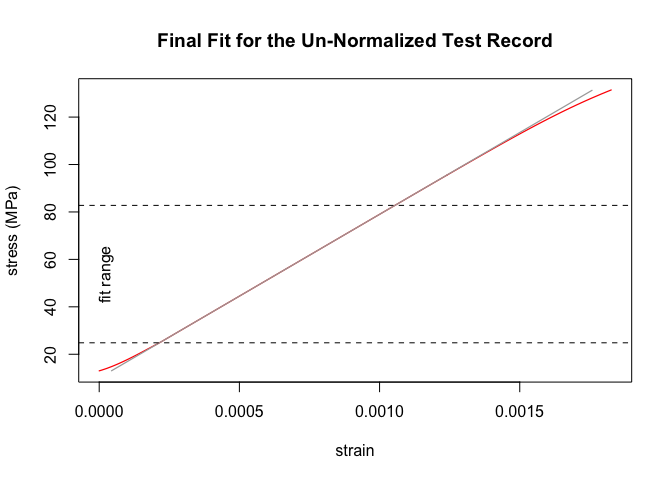

<!-- badges: start -->

[](https://github.com/soylentOrange/sdarr/actions/workflows/R-CMD-check.yaml)
<!-- [](https://cran.r-project.org/package=sdarr) -->
<!-- badges: end -->

<!-- README.md is generated from README.Rmd. Please edit that file -->

# sdarr

The sdarr-package provides a R implementation of the algorithm for Slope
Determination by Analysis of Residuals (SDAR) as standardized in [ASTM
E3076-18](https://doi.org/10.1520/E3076-18).  
It allows for automated and objective linear-fitting of mechanical
test-data. See a detailed description of the algorithm in the [NIST
Technical Note 2050 by E. Lucon](https://doi.org/10.6028/NIST.TN.2050)
or in [Graham & Adler (2011)](https://doi.org/10.1520/JTE103038).

As the SDAR-algorithm, implemented in `sdar()`, heavily uses linear
regressions, a faster version `sdar_lazy()` was implemented, which finds
the optimum region for the final linear regression by random
sub-sampling within the normalized range of the test-data.

## Installation

You can install the latest release version of sdarr from
[GitHub](https://github.com/soylentOrange/sdarr/releases/) with:

``` r
# install.packages("devtools")
devtools::install_github("soylentOrange/sdarr@*release")
```

You can install the development version of sdarr from
[GitHub](https://github.com/soylentOrange/sdarr/) with:

``` r
# install.packages("devtools")
devtools::install_github("soylentOrange/sdarr")
```

## Examples

### Standard SDAR-algorithm

A basic example of using `sdar()` on a synthetic data set, which is
based on the properties of aluminium (EN AW-6060-T66). A toe-region and
a non-zero intercept are added to make the test data less boring.

`sdar()` analyzes the data and will give a small report as a message. It
should confirm the Young’s-modulus of 69 GPa and an intercept of 10 MPa.
To make use of multi-core processing, configure
[furrr](https://furrr.futureverse.org/) to use a multi-session strategy.

``` r
library(sdarr)

# setup multisession calculations with a maximum of 8 cores
# (or however many cores are available...)
future::plan(future::multisession,
  workers = min(c(parallelly::availableCores(), 8))
)

# Synthesize a test record resembling EN AW-6060-T66
Al_6060_T66 <- synthesize_test_data(
  slope = 69000, yield.y = 160,
  ultimate.y = 215, ultimate.x = 0.08,
  offset = 10,
  toe.start.y = 3, toe.end.y = 15,
  toe.start.slope = 13600
)

# Analyze the test record
Al_6060_T66.result <- sdar(Al_6060_T66,
  x = strain, y = stress)
#> Determination of Slope in the Linear Region of a Test Record:
#> SDAR-algorithm
#>   Data Quality Metric: Digital Resolution
#>     x
#>       Relative x-Resolution:   0.333333333333333
#>       % at this resolution:    0
#>       % in zeroth bin:         100
#>       --> pass
#>     y
#>       Relative y-Resolution:   0.333333333333333
#>       % at this resolution:    0.268096514745308
#>       % in zeroth bin:         99.7319034852547
#>       --> pass
#>   Data Quality Metric: Noise
#>     x
#>       Relative x-Noise:        1.14246654063749e-14
#>       --> pass
#>     y
#>       Relative y-Noise:        0.0572451173412188
#>       --> pass
#>   Fit Quality Metric: Curvature
#>     1st Quartile
#>       Relative Residual Slope: 0.00200695921876536
#>       Number of Points:        44
#>       --> pass
#>     4th Quartile
#>       Relative Residual Slope: -0.00712826619905767
#>       Number of Points:        44
#>       --> pass
#>   Fit Quality Metric: Fit Range
#>       relative fit range:      0.817634510547523
#>       --> pass
#>   Un-normalized fit
#>       Final Slope:             68995.0585161614 MPa
#>       True Intercept:          10.002547500777 MPa
#>       y-Range:                 24.8291015625 MPa - 82.7682495117188 MPa
```



### Random sub-sampling modification of the SDAR-algorithm

A basic example of `sdar_lazy()`, a random sub-sampling modification of
the SDAR-algorithm on a synthetic data set, which is based on the
properties of aluminium (EN AW-6060-T66). A toe-region and a non-zero
intercept are added to make the test data less boring (see above).

`sdar_lazy()` analyzes the data for the optimum size of the fitting
region via random sub-sampling. It will give a small report as a message
after finding the optimum fit. It should confirm the Young’s-modulus of
69 GPa and an intercept of 10 MPa. As the synthetic data set is
noise-free (except for quantization-noise), only one random sub-sampling
run will do.

To make use of multicore processing, configure
[furrr](https://furrr.futureverse.org/) to use a multisession strategy
(see above).

``` r
# set a random seed
set.seed(50041180)

# Analyze the test record
# (with enforced random sub-sampling)
Al_6060_T66.result_lazy <- sdar_lazy(Al_6060_T66,
  x = strain, y = stress, plot = FALSE, enforce_subsampling = TRUE)
#> Determination of Slope in the Linear Region of a Test Record:
#> Random sub-sampling modification of the SDAR-algorithm
#>   Random sub-sampling information:
#>       118 points of 375 points in the normalized range were used.
#>       0 % of the sub-samples passed the data quality checks.
#>       100 % of the sub-samples passed the fit quality checks.
#>       0 % of the sub-samples passed all quality checks.
#> 
#>   Data Quality Metric: Digital Resolution
#>     x
#>       Relative x-Resolution:   0.333333333333333
#>       % at this resolution:    0
#>       % in zeroth bin:         100
#>       --> pass
#>     y
#>       Relative y-Resolution:   0.333333333333333
#>       % at this resolution:    0.268096514745308
#>       % in zeroth bin:         99.7319034852547
#>       --> pass
#>   Data Quality Metric: Noise
#>     x
#>       Relative x-Noise:        1.14246654063749e-14
#>       --> pass
#>     y
#>       Relative y-Noise:        0.0572451173412188
#>       --> pass
#>   Fit Quality Metric: Curvature
#>     1st Quartile
#>       Relative Residual Slope: 0.00287008465272615
#>       Number of Points:        43
#>       --> pass
#>     4th Quartile
#>       Relative Residual Slope: -0.00734852665893149
#>       Number of Points:        43
#>       --> pass
#>   Fit Quality Metric: Fit Range
#>       relative fit range:      0.827242206235012
#>       --> pass
#>   Un-normalized fit
#>       Final Slope:             68995.3087875296 MPa
#>       True Intercept:          10.0023835307365 MPa
#>       y-Range:                 25.15869140625 MPa - 82.4249267578125 MPa
```

### Plot Functions

`sdar()` and `sdar_lazy()` will create diagnostic plots throughout
calculations, which will only be shown when requested (i.e. set
`plot = TRUE` for showing a plot of the final fit, or `plot.all = TRUE`
for showing all additional diagnostic plots). To have a plot drawn
later, you can call the provided plot-function from the results.

The plot-functions are [crated](https://github.com/r-lib/carrier), so
you can easily tap their environment to convert it into e.g. a
[ggplot2-graphic](https://ggplot2.tidyverse.org/).

``` r
# show plot of final fit using the plot function from the result (see above)
Al_6060_T66.result_lazy$plots$final.fit()
```


``` r
# satisfy pipe addiction...
library(magrittr)
# make nice and shiny graphics with ggplot2...
library(ggplot2)

# plot the final fit using ggplot2
Al_6060_T66.result_lazy %>% {
  
  # tap the environment of the crated plot-function
  plot.env <- rlang::fn_env(.$plots$final.fit)

  # get data and labels
  plot.data <- plot.env$plot.data
  plot.main <- plot.env$plot.main
  plot.xlab <- plot.env$plot.xlab
  plot.ylab <- plot.env$plot.ylab
  plot.y.data.max <- plot.data$y.data %>% max()
  plot.y.lowerBound <- plot.env$y.lowerBound
  plot.y.upperBound <- plot.env$y.upperBound

  # create the ggplot2
  plot.data %>% ggplot(aes(x = x.data, y = y.data,
                           color = "Test data\n(EN AW-6060-T66)")) +
    geom_line() +
    geom_line(data = plot.data %>%
                dplyr::filter(y.fit <= plot.y.data.max),
              aes(x = x.data, y = y.fit, color = "fit (sdar_lazy)")) +
    geom_hline(aes(color = "fit range",
                   yintercept = plot.y.lowerBound),
               linetype = "dashed", show.legend = TRUE) +
    geom_hline(aes(color = "fit range",
                   yintercept = plot.y.upperBound),
               linetype = "dashed",show.legend = TRUE) +
    theme_bw() +
    labs(title = plot.main,
         x = plot.xlab,
         y = plot.ylab,
         caption = paste0("Result of the random sub-sampling SDAR-algorithm:",
                          "\n\nFinal Slope: ",
                          round(.$sdar$finalSlope / 1000, 1), " GPa",
                          "\nTrue Intercept: ",
                          round(.$sdar$trueIntercept, 1), " MPa","
                          \n\nFit Range: ",
                          round(plot.y.lowerBound, 1), " MPa - ",
                          round(plot.y.upperBound, 1), " MPa"))
}
```


# Acknowledgements

The sdarr-package was created for the analysis of mechanical test data
for the project LOBio, which is funded by the German ministry of
education and research (BMBF) under grant number 13XP5174C.
